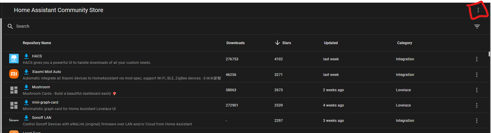
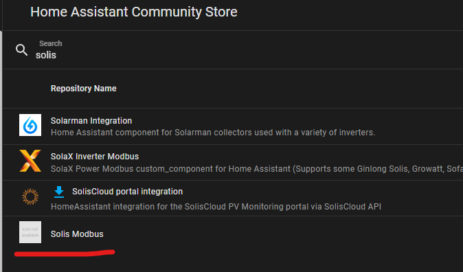
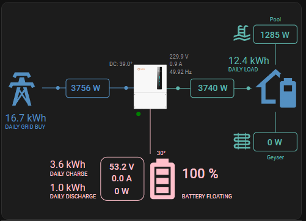

# Solis Modbus Integration for Home Assistant

## Description

The Solis S6 Modbus Integration for Home Assistant is a streamlined solution to connect your Solis S6 inverter with Home Assistant. This integration was inspired by [fboundy's ha_solis_modbus](https://github.com/fboundy/ha_solis_modbus/tree/main). However, it enhances the native Modbus integration in Home Assistant by consolidating multiple register queries into single calls, eliminating unnecessary overhead.

## Installation
[](https://my.home-assistant.io/redirect/hacs_repository/?owner=Pho3niX90&repository=solis_modbus&category=integration)

To install the Solis Modbus Integration, follow these steps:

1. Open your Home Assistant instance.
2. Navigate to the "HACS".
3. Click the 3 dots menu

4. Click on "Custom Repositories"

5. Fill in the repository "https://github.com/Pho3niX90/solis_modbus", and category "Integration"
6. Now search for "Solis Modbus"

7. Click on Download

## Total Sensors
Whilst the solis inverters do provide total sensors for today, yesterday, month and year. I highly suggest to create a utility meter in HA, as a time difference between HA and Solis might have the values reset before midnight, causing issues in charts.

## Manual Installtion
1. Copy the "solis_modbus" folder into your "custom_components" folder

## Setup
1. Navigate to Settings -> Devices & Services
2. Click on "+ Add Integration"
3. Search for "Solis Modbus"
4. Add in the IP of your inverter in the first box, and port in the second.

# sunsynk solar card setup:

```yaml
type: custom:sunsynk-power-flow-card
view_layout:
  grid-area: flow
cardstyle: lite
large_font: true
show_solar: true
panel_mode: true
card_height: 415px
inverter:
  model: solis
  modern: false
  colour: '#959595'
  autarky: 'no'
solar:
  mppts: 2
  show_daily: false
  colour: '#F4C430'
  animation_speed: 9
  max_power: 9600
  pv1_name: West
  pv2_name: North
battery:
  energy: 14280
  shutdown_soc: 20
  show_daily: true
  colour: pink
  animation_speed: 6
  max_power: 6000
load:
  show_aux: false
  show_daily: true
  animation_speed: 8
  max_power: 6000
  additional_loads: 2
  load2_name: Geyser
  load2_icon: mdi:heating-coil
  load1_name: Pool
  load1_icon: mdi:pool
grid:
  show_daily_buy: true
  no_grid_colour: red
  animation_speed: 8
  max_power: 6000
  invert_grid: true
entities:
  dc_transformer_temp_90: sensor.solis_inverter_temperature
  day_battery_charge_70: sensor.solis_inverter_today_battery_charge_energy
  day_battery_discharge_71: sensor.solis_inverter_today_battery_discharge_energy
  day_load_energy_84: sensor.solis_inverter_today_energy_consumption
  day_grid_import_76: sensor.solis_inverter_today_energy_imported_from_grid
  day_grid_export_77: sensor.solis_inverter_today_energy_fed_into_grid
  day_pv_energy_108: sensor.solis_inverter_pv_today_energy_generation
  inverter_voltage_154: sensor.solis_inverter_a_phase_voltage
  load_frequency_192: sensor.solis_inverter_grid_frequency
  inverter_current_164: sensor.solis_inverter_a_phase_current
  inverter_power_175: sensor.solis_inverter_backup_load_power
  grid_power_169: sensor.solis_inverter_ac_grid_port_power
  battery_voltage_183: sensor.solis_inverter_battery_voltage
  battery_soc_184: sensor.solis_inverter_battery_soc
  battery_power_190: sensor.solis_inverter_battery_power
  battery_current_191: sensor.solis_inverter_battery_current
  essential_power: sensor.solis_inverter_backup_load_power
  grid_ct_power_172: sensor.solis_inverter_meter_total_active_power
  pv1_voltage_109: sensor.solis_inverter_dc_voltage_1
  pv1_current_110: sensor.solis_inverter_dc_current_1
  pv1_power_186: sensor.solis_inverter_dc_power_1
  pv2_power_187: sensor.solis_inverter_dc_power_2
  pv_total: sensor.solis_inverter_total_dc_output
  pv2_voltage_111: sensor.solis_inverter_dc_voltage_2
  pv2_current_112: sensor.solis_inverter_dc_voltage_2
  grid_voltage: sensor.solis_inverter_a_phase_voltage
  battery_current_direction: sensor.solis_inverter_battery_current_direction
  inverter_status_59: sensor.solis_inverter_current_status
  remaining_solar: sensor.solcast_pv_forecast_forecast_remaining_today
```

## Tested
**Inverters Tested**
- Solis S6 Pro 6kW Advanced Hybrid Inverter

**Wifi Dongles Tested**
- S2_WL_ST
